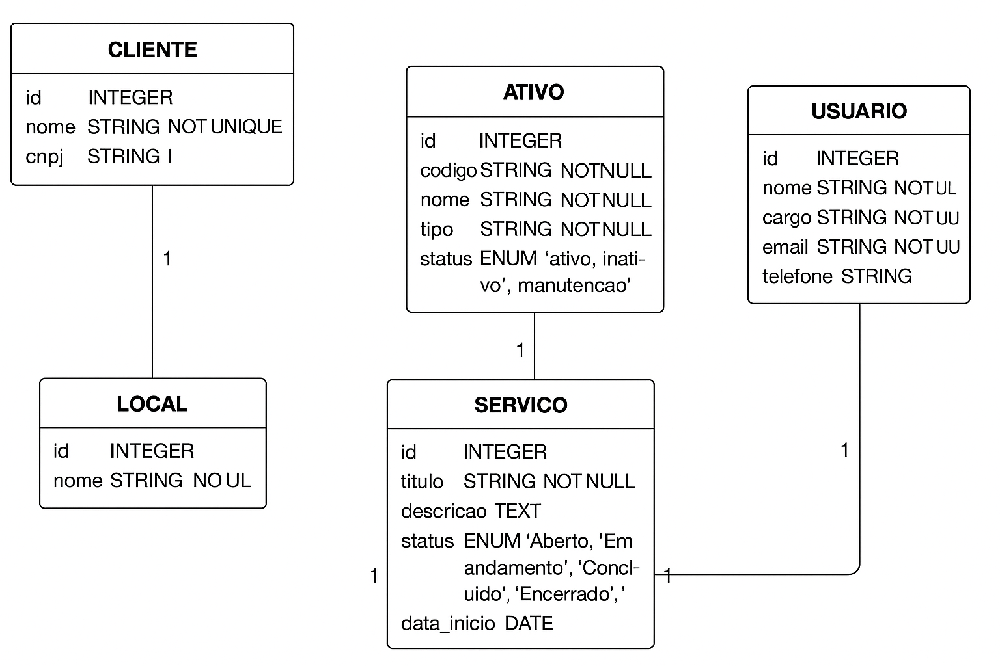

# 📘 Sistema de Gestão de Ativos e Serviços

Este projeto tem como objetivo oferecer uma estrutura completa para o gerenciamento de ativos, serviços técnicos e fluxo operacional com controle de SLA.

---

## 🔑 Entidades Principais

### 🧍 Cliente
Representa a organização ou pessoa que possui ativos e solicita serviços.

- **Atributos**: `id`, `nome`, `cnpj`, `contatos`
- **Relacionamentos**:
  - Possui vários **Ativos**
  - Solicita vários **Serviços**

### 👤 Usuário
Técnicos, gestores ou solicitantes envolvidos no ciclo de atendimento.

- **Atributos**: `id`, `nome`, `cargo`, `email`, `telefone`
- **Relacionamentos**:
  - Pode ser **Solicitante** de serviços
  - Pode ser **Responsável** pela execução

### 📍 Local
Define onde os ativos estão alocados (ex: cidade, filial, prédio).

- **Atributos**: `id`, `nome`
- **Relacionamentos**:
  - Contém vários **Ativos**

### ⚙️ Ativo
Equipamento, sistema ou recurso monitorado.

- **Atributos**: `id`, `codigo`, `nome`, `tipo`, `status`
- **Relacionamentos**:
  - Pertence a um **Cliente**
  - Está alocado em um **Local**
  - Associado a vários **Serviços**

### 🧾 Tipo de Serviço
Classificação dos serviços com regras de SLA.

- **Atributos**: `id`, `nome`, `descricao`, `tempo_medio`, `sla_horas`
- **Relacionamentos**:
  - Classifica vários **Serviços**
- **Regras**:
  - Permite verificar se um serviço foi concluído dentro do SLA

### 🛠️ Serviço
Chamado, manutenção ou atendimento técnico.

- **Atributos**: `id`, `titulo`, `descricao`, `status`, `data_inicio`, `data_fim`
- **Relacionamentos**:
  - Associado a um **Cliente**
  - Vinculado a um **Ativo**
  - Possui um **Tipo de Serviço**
  - Possui um **Solicitante** e um **Responsável** (Usuários)

---

### Entidades e Relacionamentos
| Modelo      | Campos principais                                                | Relacionamentos                                                                                                                                                     |
| ----------- | ---------------------------------------------------------------- | ------------------------------------------------------------------------------------------------------------------------------------------------------------------- |
| **Cliente** | `id`, `nome`, `cnpj`, `contatos`                                 | `hasMany(Ativo)` → `ativos`<br>`hasMany(Servico)` → `servicos`                                                                                                      |
| **Ativo**   | `id`, `codigo`, `nome`, `tipo`, `status`                         | `belongsTo(Cliente)` → `cliente`<br>`belongsTo(Local)` → `local`<br>`hasMany(Servico)` → `servicos`                                                                 |
| **Servico** | `id`, `titulo`, `descricao`, `status`, `data_inicio`, `data_fim` | `belongsTo(Cliente)` → `cliente`<br>`belongsTo(Ativo)` → `ativo`<br>`belongsTo(TipoServico)` → `tipoServico`<br>`belongsTo(Usuario)` → `solicitante`, `responsavel` |
| **Local**   | `id`, `nome`                                                     | `hasMany(Ativo)` → `ativos`                                                                                                                                         |
| **Usuario** | `id`, `nome`, `cargo`, `email`, `telefone`                       | Relacionado a `Servico` como solicitante ou responsável                                                                                                             |

---
---
### Diagrama conceitual resumido

```text
Cliente 1---* Ativo *---1 Local
Cliente 1---* Servico *---1 Ativo
Usuario 1---* Servico (solicitante/responsavel)
Servico *---1 TipoServico
```
---


## 📂 Estrutura no Node.js

```
src/
│── app.js
│── config/
│   └── database.js
│── models/
│   ├── cliente.js
│   ├── usuario.js
│   ├── local.js
│   ├── ativo.js
│   ├── tipoServico.js
│   └── servico.js
│── routes/
│   ├── clientes.routes.js
│   ├── usuarios.routes.js
│   ├── locais.routes.js
│   ├── ativos.routes.js
│   ├── tiposServicos.routes.js
│   └── servicos.routes.js
│── controllers/
│   ├── clientes.controller.js
│   ├── usuarios.controller.js
│   ├── ativos.controller.js
│   ├── servicos.controller.js

```
---


---
## 🔄 Fluxo do Ciclo de Vida de um Serviço

```text
Aberto → Em andamento → Concluído → Encerrado
--


