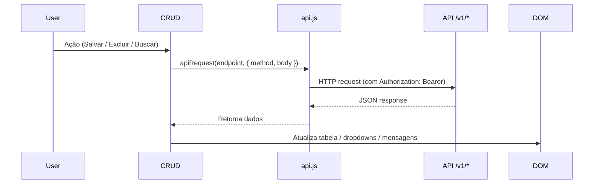
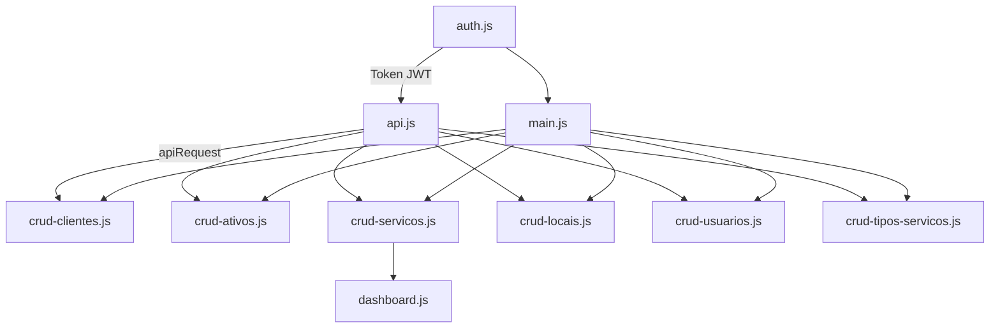

# 🧱 CRUD Modules — GestãoFácil Frontend

> 📘 **Resumo:**  
> Este documento descreve a arquitetura e o funcionamento dos módulos CRUD (Create, Read, Update, Delete) da aplicação **GestãoFácil**, que interagem com o backend `/api/v1/*` protegido por JWT.  
> Todos os módulos são carregados dinamicamente no front-end e compartilham a mesma base de autenticação (`auth.js`) e requisições (`api.js`).

---

## ⚙️ Estrutura Geral dos CRUDs

Cada módulo CRUD segue a mesma arquitetura base:

| Função | Responsabilidade |
|--------|------------------|
| `load<Entity>()` | Lista registros paginados |
| `save<Entity>()` | Cria ou atualiza registros |
| `delete<Entity>()` | Remove registros |
| `search<Entity>()` | Filtra registros |
| `render<Entity>Table()` | Atualiza a tabela HTML |
| `updatePagination()` | Controla a paginação |

Todos utilizam o helper `apiRequest()` do arquivo [`api.js`](../public/js/api.js), que injeta automaticamente o cabeçalho `Authorization: Bearer <token>`.

---

## 🔐 Dependências Comuns

| Dependência | Função |
|-------------|--------|
| **`auth.js`** | Define `authToken` e `currentUser` após login |
| **`api.js`** | Envia requisições autenticadas via `apiRequest()` |
| **`main.js`** | Controla layout, navegação e paginação |
| **`dashboard.js`** | Atualiza estatísticas após operações CRUD |

---

## 🧩 CRUD: CLIENTES (`crud-clientes.js`)

Gerencia os **clientes** da aplicação.

### Endpoints REST
```

GET    /v1/clientes
POST   /v1/clientes
PUT    /v1/clientes/:id
DELETE /v1/clientes/:id

````

### Campos Padrão
| Campo | Tipo | Descrição |
|--------|------|------------|
| `nome` | String | Nome do cliente |
| `cnpj` | String | CNPJ da empresa |
| `contatos` | String | E-mail ou telefone |
| `endereco` | String | Localização do cliente |

### Principais Funções
```js
loadClientes();    // Lista clientes
saveClient();      // Cria ou atualiza cliente
deleteCliente();   // Remove cliente
searchClientes();  // Filtra pelo nome ou CNPJ
````

### Interações

* Atualiza dropdowns em módulos de **Serviços** e **Ativos**.
* Envia notificações de sucesso via `showNotification()`.

---

## 🏢 CRUD: LOCAIS (`crud-locais.js`)

Gerencia **locais físicos de instalação** (endereços, unidades, regiões).

### Endpoints

```
GET    /v1/locais
POST   /v1/locais
PUT    /v1/locais/:id
DELETE /v1/locais/:id
```

### Campos Padrão

| Campo       | Tipo   | Descrição             |
| ----------- | ------ | --------------------- |
| `nome`      | String | Nome do local         |
| `endereco`  | String | Endereço completo     |
| `latitude`  | Float  | Coordenada geográfica |
| `longitude` | Float  | Coordenada geográfica |

### Funções

```js
loadLocais();
saveLocal();
deleteLocal();
searchLocais();
```

### Integrações

* Usado por `crud-ativos.js` e `crud-servicos.js` como dropdown de referência.
* Atualiza dropdowns via `refreshAllDropdowns()` do `main.js`.

---

## ⚙️ CRUD: TIPOS DE SERVIÇOS (`crud-tipos-servicos.js`)

Administra a **classificação dos serviços** (instalação, manutenção, suporte etc).

### Endpoints

```
GET    /v1/tipos-servicos
POST   /v1/tipos-servicos
PUT    /v1/tipos-servicos/:id
DELETE /v1/tipos-servicos/:id
```

### Campos

| Campo        | Tipo   | Descrição             |
| ------------ | ------ | --------------------- |
| `nome`       | String | Nome do tipo          |
| `descricao`  | String | Detalhes sobre o tipo |
| `slaHoras`   | Number | Tempo de SLA          |
| `prioridade` | String | Prioridade do serviço |

### Funções

```js
loadTiposServicos();
saveTipoServico();
deleteTipoServico();
```

### Interações

* Dropdown `servicoTipo` em `crud-servicos.js`.
* Alimenta gráficos do dashboard (serviços por tipo).

---

## 🔧 CRUD: ATIVOS (`crud-ativos.js`)

Gerencia **ativos físicos** (equipamentos, câmeras, switches, servidores...).

### Endpoints

```
GET    /v1/ativos
POST   /v1/ativos
PUT    /v1/ativos/:id
DELETE /v1/ativos/:id
```

### Campos

| Campo         | Tipo    | Descrição             |
| ------------- | ------- | --------------------- |
| `nome`        | String  | Nome do ativo         |
| `modelo`      | String  | Modelo/tipo           |
| `numeroSerie` | String  | Número de série       |
| `localId`     | Integer | ID do local associado |
| `status`      | String  | Status operacional    |

### Funções

```js
loadAtivos();
saveAtivo();
deleteAtivo();
```

### Interações

* Dropdowns em `Serviços` usam a lista de ativos.
* Dashboard exibe o total de ativos operacionais.

---

## 🧰 CRUD: SERVIÇOS (`crud-servicos.js`)

Principal módulo operacional: gerencia **ordens de serviço (OS)**.

### Endpoints

```
GET    /v1/servicos
POST   /v1/servicos
PUT    /v1/servicos/:id
DELETE /v1/servicos/:id
```

### Campos

| Campo           | Tipo    | Descrição                                              |
| --------------- | ------- | ------------------------------------------------------ |
| `descricao`     | String  | Descrição do serviço                                   |
| `clienteId`     | Integer | ID do cliente                                          |
| `ativoId`       | Integer | ID do ativo                                            |
| `usuarioId`     | Integer | ID do técnico                                          |
| `tipoServicoId` | Integer | ID do tipo de serviço                                  |
| `dataAgendada`  | Date    | Data de execução                                       |
| `status`        | String  | Estado atual (Agendado, Em Andamento, Concluído, etc.) |

### Funções

```js
loadServicos();
saveServico();
deleteServico();
searchServicos();
```

### Integrações

* Usa dados de todos os outros CRUDs (clientes, ativos, locais, usuários, tipos de serviço).
* Atualiza gráficos do dashboard e a contagem de status.

---

## 👤 CRUD: USUÁRIOS (`crud-usuarios.js`)

Administra **contas e permissões dos usuários internos**.

### Endpoints

```
GET    /v1/usuarios
POST   /v1/usuarios
PUT    /v1/usuarios/:id
DELETE /v1/usuarios/:id
```

### Campos

| Campo      | Tipo   | Descrição                       |
| ---------- | ------ | ------------------------------- |
| `nome`     | String | Nome do usuário                 |
| `email`    | String | E-mail de login                 |
| `cargo`    | String | Cargo (admin, técnico, usuário) |
| `telefone` | String | Contato                         |
| `status`   | String | Ativo/Inativo                   |

### Funções

```js
loadUsuarios();
saveUsuario();
deleteUsuario();
```

### Integrações

* Apenas **admins** (definidos em `auth.js`) podem acessar.
* Vinculado aos serviços como técnico responsável.
* Dropdowns de técnicos são atualizados em `crud-servicos.js`.

---

## 🔄 Fluxo de Interação CRUD → API → UI



---

## 🧠 Padrão de Integração

Todos os módulos CRUD:

* Usam `apiRequest()` para comunicação segura.
* Chamam `showNotification()` para feedback.
* Atualizam dropdowns via `refreshAllDropdowns()` do `main.js`.
* Respeitam `authToken` e `currentUser` definidos por `auth.js`.

---

## ✅ Boas Práticas Implementadas

✔️ Autenticação automática via JWT
✔️ Funções desacopladas e reutilizáveis
✔️ Paginação controlada e padronizada
✔️ Tratamento de erros centralizado
✔️ Estrutura consistente entre módulos
✔️ Integração nativa com dashboard e menus

---

## 🧩 Arquitetura Geral do Frontend



---

## 🧩 Estrutura de Arquivos

```
/public/js/
├── api.js
├── auth.js
├── main.js
├── dashboard.js
├── crud-clientes.js
├── crud-ativos.js
├── crud-servicos.js
├── crud-locais.js
├── crud-usuarios.js
└── crud-tipos-servicos.js
```

---

## 💡 Sugestão de Melhoria Futura

* [ ] Adicionar **modais dinâmicos** com feedbacks visuais (Bootstrap Toasts).
* [ ] Implementar **cache local** para listas grandes.
* [ ] Adicionar **filtros avançados** nos CRUDs (status, data, etc.).
* [ ] Integrar **WebSocket / SSE** para atualizar status de serviços em tempo real.
* [ ] Criar **logs de auditoria** no backend com `userId`.

---

## 🧾 Créditos

**Autor:** [Érico de Freitas Neto](https://github.com/EricofreitasNeto)
**Projeto:** GestãoFácil
**Tecnologias:** JavaScript, HTML5, Bootstrap, REST API JWT, Node.js (Express)
**Última atualização:** Novembro de 2025

```