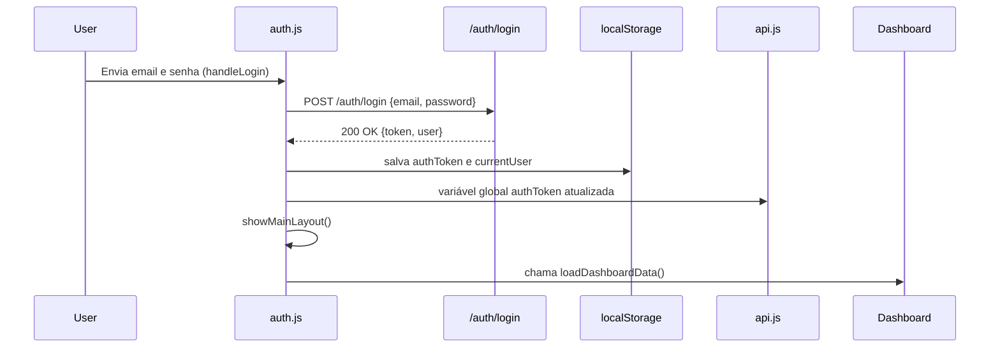
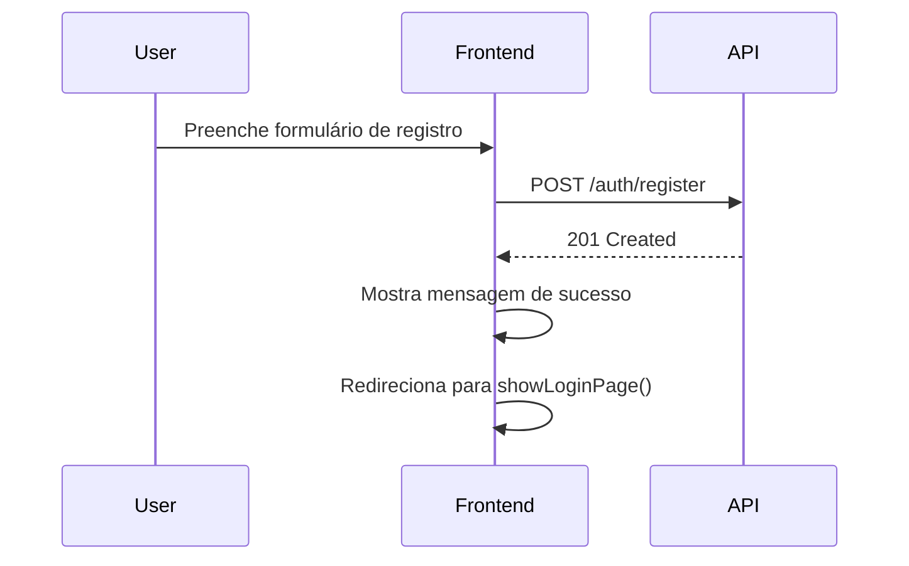

## 🧭 VISÃO GERAL DO FLUXO

O `auth.js` controla **três responsabilidades principais**:

1. **Autenticação e persistência do usuário (login, logout, registro).**
2. **Transição de layout (entre login, registro e painel principal).**
3. **Propagação do estado de autenticação para outros scripts** (`api.js`, `main.js`, CRUDs e dashboard).

---

## 🔐 1. LOGIN E GERAÇÃO DO TOKEN (interação com `api.js`)

### Fluxo técnico:



🔸 **Interação com `api.js`:**

* O `auth.js` armazena o `authToken` e o `currentUser` no `localStorage`.
* O `api.js` sempre lê esse token para enviar `Authorization: Bearer <token>` nas requisições.
* Se o token expirar, o `api.js` força logout automático.

🔸 **Interação com `dashboard.js` e CRUDs:**

* Assim que o login é concluído, `auth.js` chama:

  ```js
  loadDashboardData();
  refreshAllDropdowns();
  ```

  Isso inicializa os dados protegidos do painel.

---

## 🧩 2. PERSISTÊNCIA E SINCRONIZAÇÃO (interação com `main.js`)

O `main.js` é o **script de inicialização global**.
Ele verifica se existe `authToken` no `localStorage` (que foi salvo pelo `auth.js`) para restaurar automaticamente o login após um refresh.

### Fluxo:

```js
window.addEventListener('DOMContentLoaded', () => {
  const token = localStorage.getItem('authToken');
  if (token) {
    showMainLayout(); // função do auth.js
    refreshAllDropdowns(); // função do main.js
    SECTION_LOADERS.dashboard(); // carrega dados
  } else {
    showLoginPage(); // função do auth.js
  }
});
```

🔹 **Interação bidirecional:**

* `main.js` chama `showMainLayout()` e `showLoginPage()` (vindas do `auth.js`).
* `auth.js` depende do `main.js` para acionar eventos (`setupEventListeners`) e atualizar dropdowns.

---

## 🧠 3. REGISTRO DE NOVO USUÁRIO

### Fluxo:



🔸 **Interação com `api.js`:**

* Usa `fetch` direto, **sem token**.
* Após sucesso, não autentica automaticamente — apenas orienta o usuário a logar.

---

## 🔁 4. LOGOUT GLOBAL (interação com todos os scripts)

### Quando o usuário clica em “Sair”:

```js
function handleLogout(event) {
  authToken = null;
  currentUser = {};
  localStorage.removeItem('authToken');
  localStorage.removeItem('currentUser');
  showLoginPage();
}
```

* Remove o token do `localStorage` → faz com que o `api.js` **pare de enviar Authorization**.
* Todos os scripts que dependem de `apiRequest()` (CRUDs, dashboard) passam a receber `401 Unauthorized`.
* O `api.js` intercepta o `401` e faz logout automático (fallback).

---

## 🧱 5. CONTROLE DE LAYOUT E VISIBILIDADE

O `auth.js` também faz o controle da interface baseado no cargo do usuário (`admin`, `tecnico`, `usuario`):

```js
function updateUIForUserRole(role) {
  const adminMenus = document.querySelectorAll('.admin-only');
  adminMenus.forEach(menu => menu.classList.toggle('visible', role === 'admin'));
}
```

🔸 Isso afeta:

* **Sidebar** (menus visíveis ou não).
* **Botões de ação** (edição, exclusão, etc.).
* **Badge de função** no header (`userRoleBadge`).

Esses elementos são usados no `index.html` e manipulados por `auth.js` e `main.js`.

---

## 🔗 6. COMO ELE SE CONECTA AOS OUTROS ARQUIVOS

| Arquivo            | Tipo de interação                                             | O que o `auth.js` usa ou fornece                     |
| ------------------ | ------------------------------------------------------------- | ---------------------------------------------------- |
| **`api.js`**       | 🔄 Compartilha variáveis globais (`authToken`, `currentUser`) | Usa para autenticar e repassa token                  |
| **`main.js`**      | 🔁 Inicialização e reload persistente                         | Usa `showMainLayout()` / `showLoginPage()`           |
| **`dashboard.js`** | 📊 Carrega dados iniciais após login                          | `auth.js` chama `loadDashboardData()`                |
| **`crud-*.js`**    | 🧱 CRUDs protegidos por JWT                                   | Requisitam via `apiRequest()` (autenticado)          |
| **`index.html`**   | 🖥️ Layout base                                               | Renderiza páginas e define eventos de login/registro |

---

## 🧠 RESUMO EXECUTIVO DO FLUXO COMPLETO

1. **Usuário abre a página:**
   `main.js` → detecta se existe token → chama `showMainLayout()` ou `showLoginPage()`.

2. **Usuário faz login:**
   `auth.js` → faz `POST /auth/login` → salva token → chama `showMainLayout()`.

3. **Painel é montado:**
   `auth.js` → chama `loadDashboardData()` e `refreshAllDropdowns()`.

4. **Requisições autenticadas:**
   `api.js` → envia `Authorization: Bearer <token>` → backend valida JWT.

5. **Token expira:**
   `api.js` → intercepta `401 Unauthorized` → remove token → força reload → `main.js` mostra login novamente.

6. **Logout manual:**
   `auth.js` → limpa token → oculta layout → mostra tela de login.

